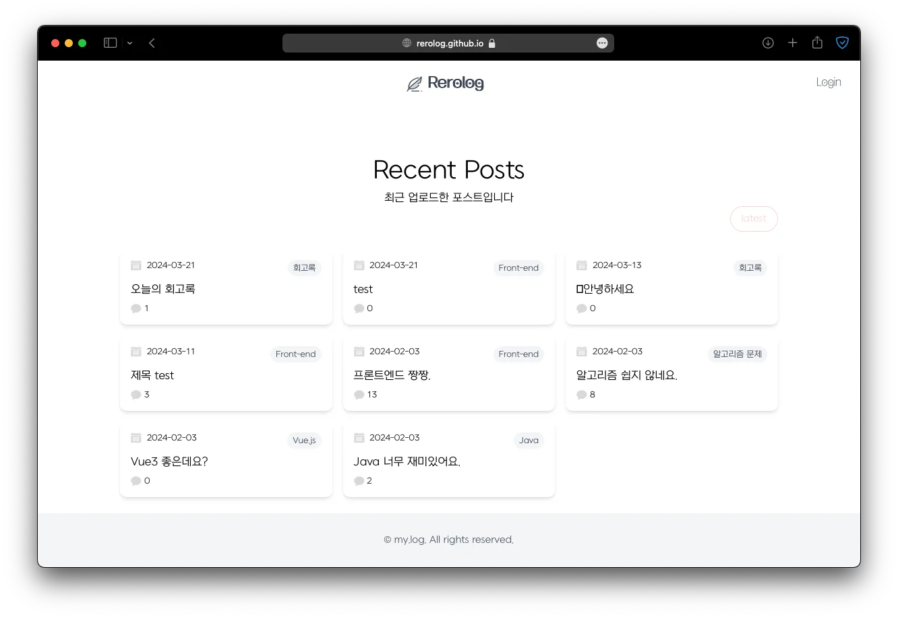
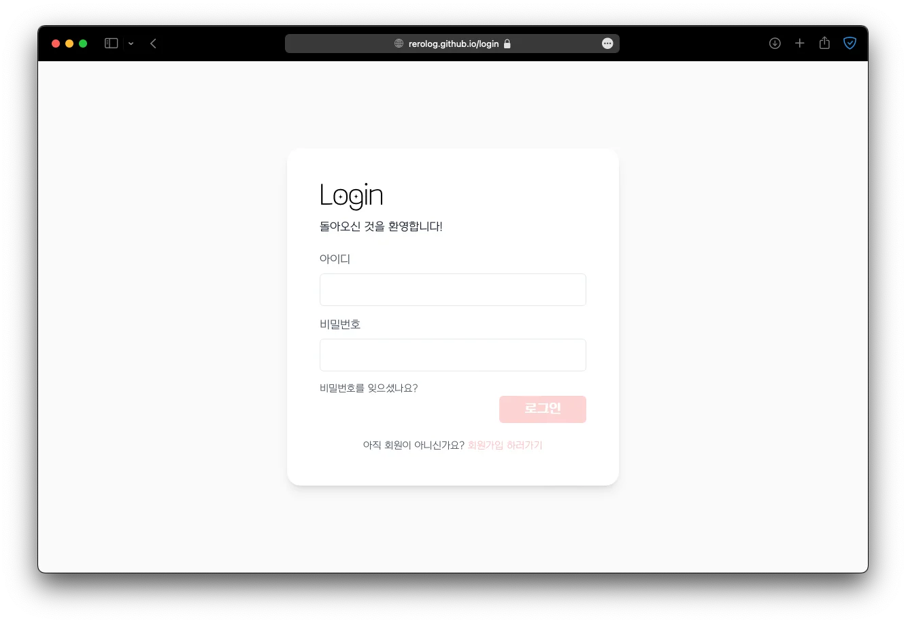
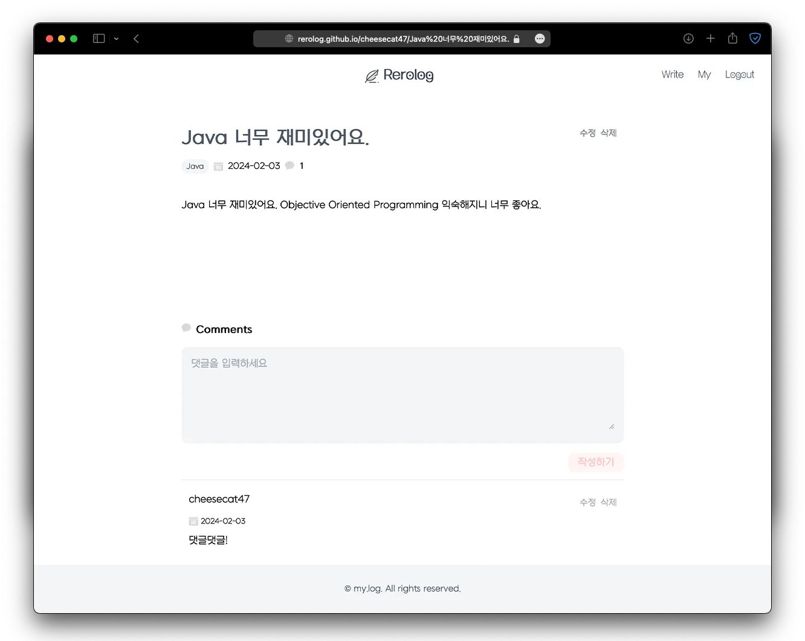
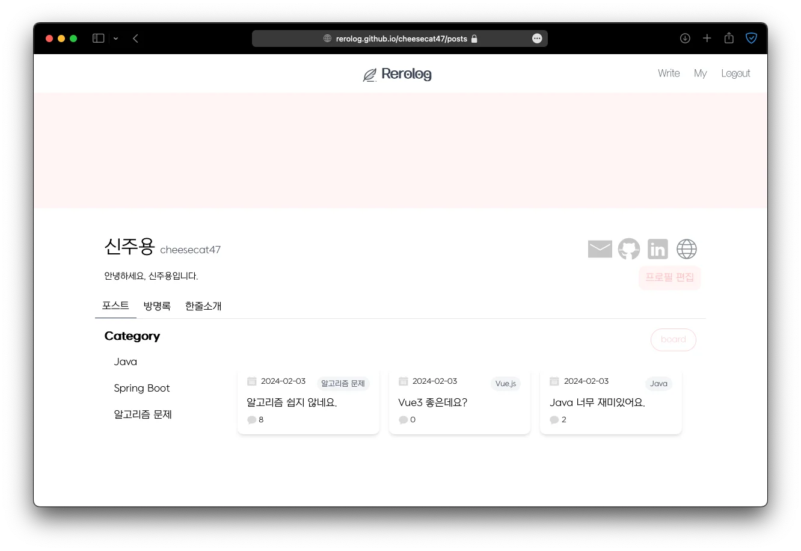

    

        
    

    <h1 style="font-size: 1.8rem">Rerolog</h1>

블로그 서비스를 만드는 프로젝트입니다.

---

## 🛠️ Teck Stack

  

---

## 👩🏻‍💻 실행 화면

|               메인 화면                |                로그인                 |
|:----------------------------------:|:----------------------------------:|
|  |  |
|              글 상세 보기               |              글 작성, 수정              |
|  |  |
|               마이페이지                |              내 정보 수정               |
|  |  |

---

## Version History

- Release v1.0.0: <https://rerolog.github.io>

---

## 🗓️ Development Period

`2023.12.01.~2024.03.12.`

---

## Authors

- [@cheesecat47](https://github.com/cheesecat47)
- [@rosielsh](https://github.com/rosielsh)
