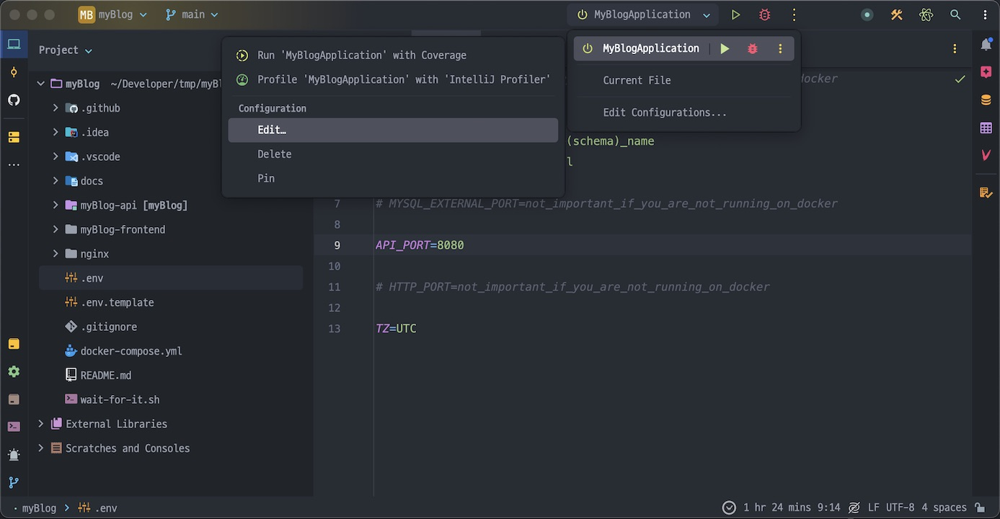
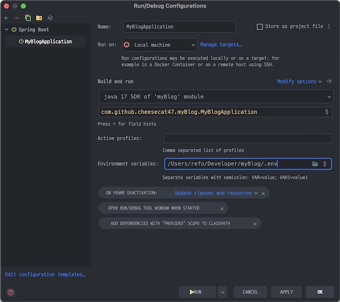

# myBlog

> 블로그 서비스를 만들어보는 프로젝트입니다.


## Tech Stack

- FE: Vue.js
- API: Spring Boot 3, MyBatis, MySQL
- Deploy: NGINX, Docker, Docker Compose

## Run

- 프로젝트 클론 후 디렉토리로 이동

    ```bash
    git clone https://github.com/cheesecat47/myBlog.git
    cd myBlog
    ```

- `.env` 파일의 환경 변수 수정

    ```bash
    cp .env.template .env
    ```

### Docker

- Prerequisites
    - Docker
    - Docker Compose

1. 도커 명령어 실행

    ```bash
    docker compose up -d --build && docker compose logs -f --tail=1000
    ```

### Local

#### Database

- Prerequisites
  - MySQL 8.0.34

1. `myBlog-api/resources/sql` 디렉토리로 이동

    ```bash
   cd myBlog-api/resources/sql
    ```

2. MySQL Workbench, CLI 등에서 SQL 파일(`01.schema.sql`, `02.data.sql` ...) 순서대로 실행.

#### API server

- Prerequisites
    - Java 17
    - Maven 3.9
    - IntelliJ IDEA (Preferred)

1. IntelliJ IDEA에서 `myBlog` 디렉토리 열기
   
2. 환경 변수 수정
   
3. 실행 설정 변경
   
4. `Modify Options` > `Environment variables`로 환경 변수 파일 경로 지정.
   
5. 실행 후 <http://localhost:8080/api/swagger-ui/index.html>로 이동
   

#### FE Dev server

- Prerequisites
  - Node v18

1. `myBlog-frontend` 디렉토리로 이동

    ```bash
    cd myBlog-frontend/
    npm install
    npm run dev
    ```

## Documentations

- [기능 명세서](docs/feature-spec.md)
- [ERD](docs/ERD.md)
- [화면 설계서](docs/pages.md)
- [API 명세서](docs/API-spec.md)

## Author

- [@cheesecat47](https://github.com/cheesecat47)

## Contributors

- [@rosielsh](https://github.com/rosielsh)
- [@yeaaaaahhhhh](https://github.com/yeaaaaahhhhh)
- [@HeewonYoun](https://github.com/HeewonYoun)
