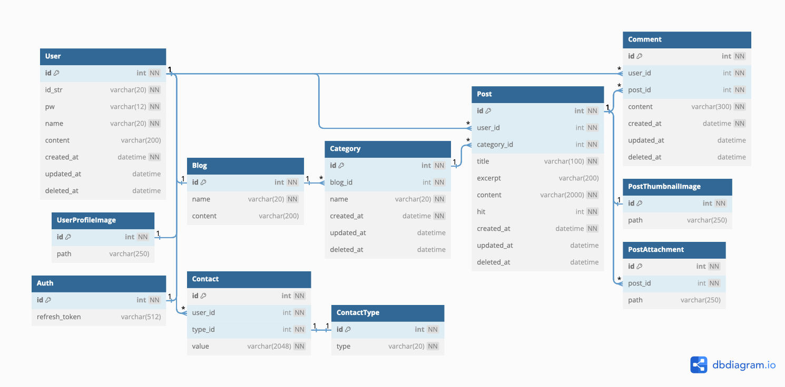
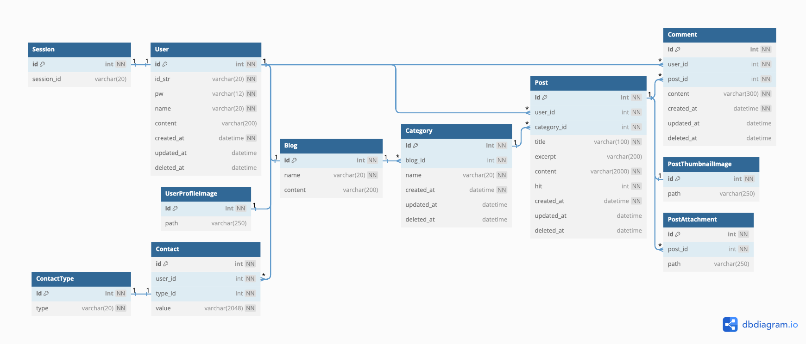
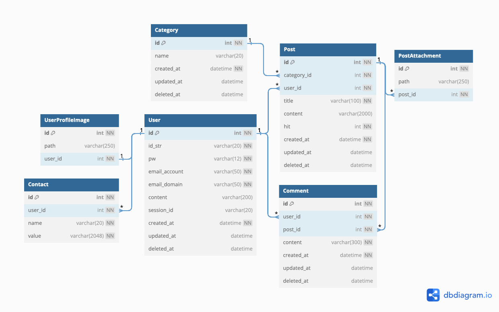

# ERD

## 2024.01.13.

### 변경 내역

- 인증 방법을 토큰 기반으로 변경하여 `Session` 테이블을 `Auth` 테이블로 변경하고, 컬럼명을 `refresh_token`으로 변경.

## 2024.01.09.

### 변경 내역

- `Blog` 테이블에 소개 멘트를 저장할 컬럼 `content` 추가.

## 2023.12.19.

### 변경 내역

- `Session` 테이블 추가.
    - 기존에는 `session_id` 컬럼이 `User` 테이블에 포함되어 있었으나 테이블로 분리.
- `User` 테이블에서 `email_account`, `email_domain` 컬럼 삭제.
  - 본 블로그 서비스 로그인 시 이메일 정보를 활용하지 않음.
  - `Contact`에 이메일도 저장 가능.
- `Blog` 테이블에서 `user_id`, `created_at` 컬럼 제거.
  - `User`와 `Blog`는 1대 1 관계이므로 `User`.`id`를 `Blog` 테이블의 PK로 쓰는 식별 관계로 구성 가능.
  - 또한, 유저 회원 가입 시 블로그를 자동 생성하므로 블로그 개설일은 유저 회원 가입일과 동일. 
- `Category`.`name`을 NOT NULL로 변경.
- `Post`.`excerpt` 컬럼 추가. 본문 내용을 요약하는 간단한 문장. 글 미리보기 블럭에 표시됨. `null`이면 본문 내용 앞 일부를 잘라서 자동 저장. 
- `Post`.`content` NOT NULL로 변경. 본문이 빈 글 방지.
- `SET GLOBAL time_zone` 명령 추가하여 DB 시간을 `UTC`로 지정.

## 2023.12.11.

### 변경 내역

- `Contact.name`(연락 방법)을 varchar(20) -> `type_id` int FK로 변경.
    - 기존에는 `github`, `linkedin`, `email` 같은 것을 직접 적어넣으려 했음.
    - [코드 리뷰](https://github.com/cheesecat47/myBlog/pull/17#discussion_r1421726801)에서 종류가 정해진 값이니 varchar보다 int를 쓰는것은 어떻겠냐는 의견이 있었음.
    - Enum을 사용해보려 했으나, Enum 보다는 참조 테이블을 사용하는 편이 테이블 설계나 데이터 조작 면에서 더 낫다는 블로그 글을 참고하여 테이블로 분리하고, `Contact.type_id`는 FK로 설정.
        - https://velog.io/@leejh3224/번역-MySQL의-ENUM-타입을-사용하지-말아야-할-8가지-이유
- `Blog` 테이블 추가
    - 블로그 이름, 개설일 같은 메타데이터 저장.
    - `Category.blog_id` FK 추가.
- `PostThumbnailImage` 테이블 추가
    - 포스트 썸네일 파일 저장.

## 2023.12.09.

### 변경 내역

- Footer에서 이메일, 깃허브, 링크드인 같은 연락처 정보를 보여주려 했는데, 이전 버전의 User 테이블에는 해당 정보를 담는 컬럼이 없음.
    - 참고: [화면 설계서](https://github.com/cheesecat47/myBlog/blob/main/docs/pages.md)
- `Contact` 테이블 추가
    - `user_id`를 FK로 가짐.
    - name은 연락 방법. `email`, `github`, `linkedin`, `website` 등.
    - value는 웹사이트 URL이 들어올 수 있음. 크롬 기준 32779자까지도 입력 가능하다고 하나, 권장은 2천 자 이하라고 함.
        - https://stackoverflow.com/questions/417142/what-is-the-maximum-length-of-a-url-in-different-browsers
- `Category.name` 2000자 -> 20자로 변경.
    - 카테고리명은 너무 길게 잡을 필요가 없음.

## 2023.12.04.

### 변경 내역

- 테이블 설계 초기 버전
