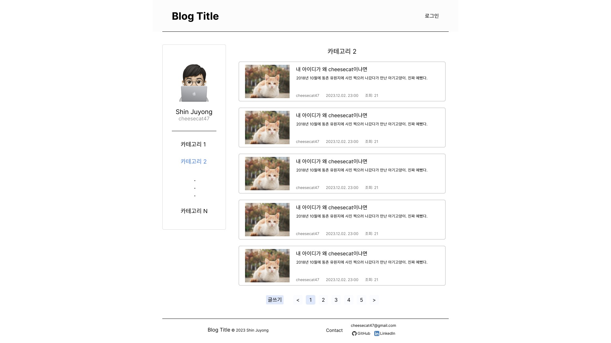

# 화면 설계서

- [Figma 링크](https://www.figma.com/file/Nv84tRYvEgXGbzw6MEBrNT/myBlog?type=design&node-id=0%3A1&mode=design&t=0HERTuqFwuzj8MjD-1)

## 메인 페이지

- 메인 페이지는 상단 Navbar, 좌측 Navbar, 본문, Footer 영역으로 구성.
    - 이 구조는 블로그 전체에서 일관되게 사용. (일부 페이지 제외)
- 본문 영역에서 '최근 글 목록', '인기 글 목록'을 제공.
    - 글 목록에서 보이는 글 미리보기 블록은 5개 정도를 보여주려고 계획하였으나, 현재 디자인에서는 스크롤이 너무 내려가서 첫 화면에 안 보일 가능성이 있음. 2열로 4개 또는 6개를 보여주는 것도 고려 중.

## 회원 관련

### 로그인 페이지

- 로그인을 위한 아이디, 비밀번호 입력 박스와 로그인 버튼이 중앙에 위치.
- 로그인 화면에서는 로그인 기능만 있는 것이 적절하다고 판단하여 좌측 Navbar는 제외.

### 소개 페이지

- 블로그 주인(유저) 정보를 배치.
    - 이름, 아이디, 프로필 사진, 소개 멘트 등.
- 소개 페이지도 기존 좌측 Navbar에 있던 프로필 이미지와 겹치므로 좌측 Navbar를 제외하고 블로그 주인(유저)의 소개만 표시.

## 게시판 관련

### 게시판 페이지

- 좌측 Navbar에서 특정 카테고리 명을 클릭했을 때 보이는 화면.
- 선택한 카테고리에 해당하는 글을 목록 형태로 보여줌.
    - 페이지네이션 기능을 추가하여 스크롤이 너무 길어지지 않도록 함.

### 글 상세 보기 페이지

- 메인 페이지 또는 게시판 페이지에서 게시글 블록을 클릭했을 때 이동하는 페이지.
- 구조는 메인 페이지와 동일.
- 본문 영역에 글 정보, 본문, 댓글 표시.
    - 글 정보에는 제목, 작성자, 작성 일시, 조회수 등의 정보 표시.

### 글 작성 페이지

- 글 작성 시에는 제목, 본문을 작성할 수 있고, 파일 첨부 영역이 아래에 위치.

### 글 수정 페이지

- 글 수정 시에는 제목, 본문을 수정할 수 있고, 첨부한 파일을 수정하는 영역이 작성 페이지와 동일하게 위치.
