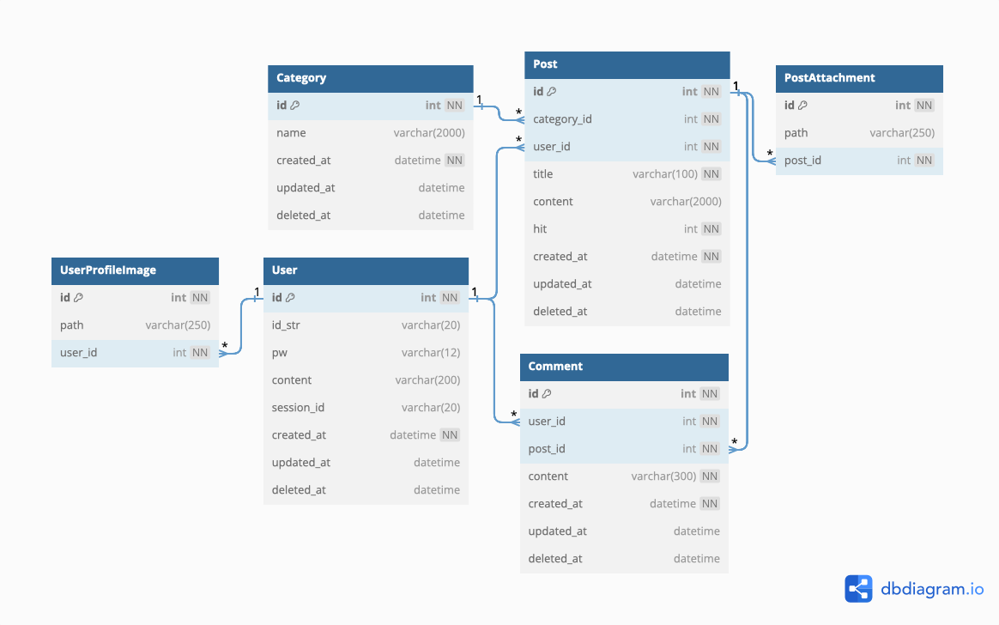

## ERD

### 2023.12.16

### 변경 내역

1. `Blog` 테이블 추가

    - 블로그 정보 테이블을 추가했습니다.

2. `Contact` 테이블 추가

    - 연락처 정보를 저장하는 테이블을 추가했습니다.
    - `type_id`는 `int`형으로 설계하였으며, `ContactType` 테이블을 두어 참조하게 하였습니다.

3. `PostThumbnailImage` 테이블 추가

    - 게시물 썸네일 이미지 테이블을 추가했습니다.

4. `PostImage` 테이블 추가

    - 게시물 이미지 테이블을 추가했습니다.

5. `User` 테이블에 컬럼 추가

    - `nickname` 컬럼을 추가했습니다.
    - `userProfileImage` 컬럼을 추가했습니다.

6. `UserProfileImage` 테이블 제거

    - `user`와 `profile` 이미지 테이블은 1:1 관계이기 때문에 테이블을 분리할 필요가 없다고 판단하여 제거했습니다.

7. `Category` 크기 변경
    - 카테고리 글자수를 2000 -> 20자로 수정했습니다.

 

### 2023.12.04

### 변경 내역

초기 설계 버전
