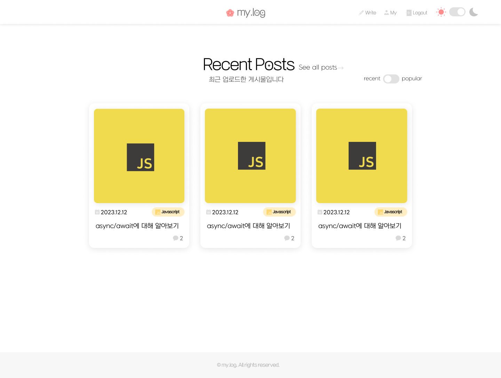
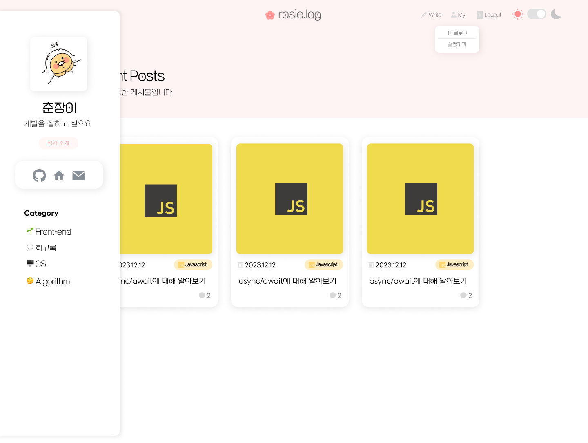
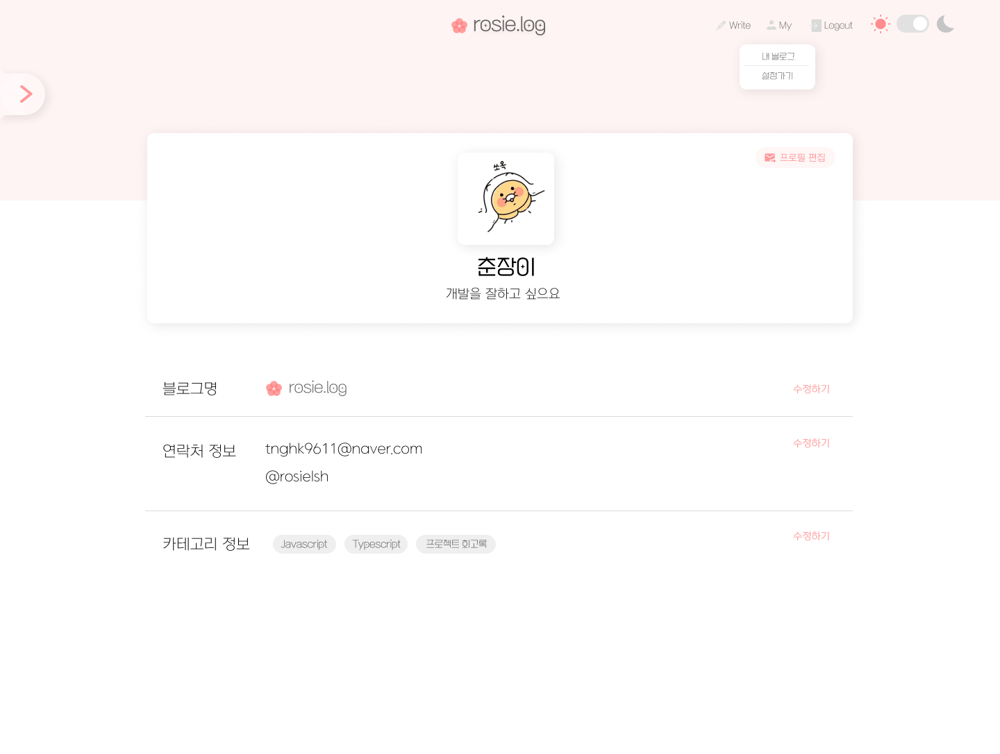
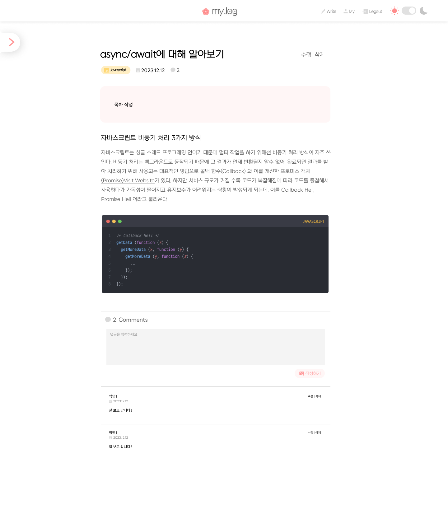
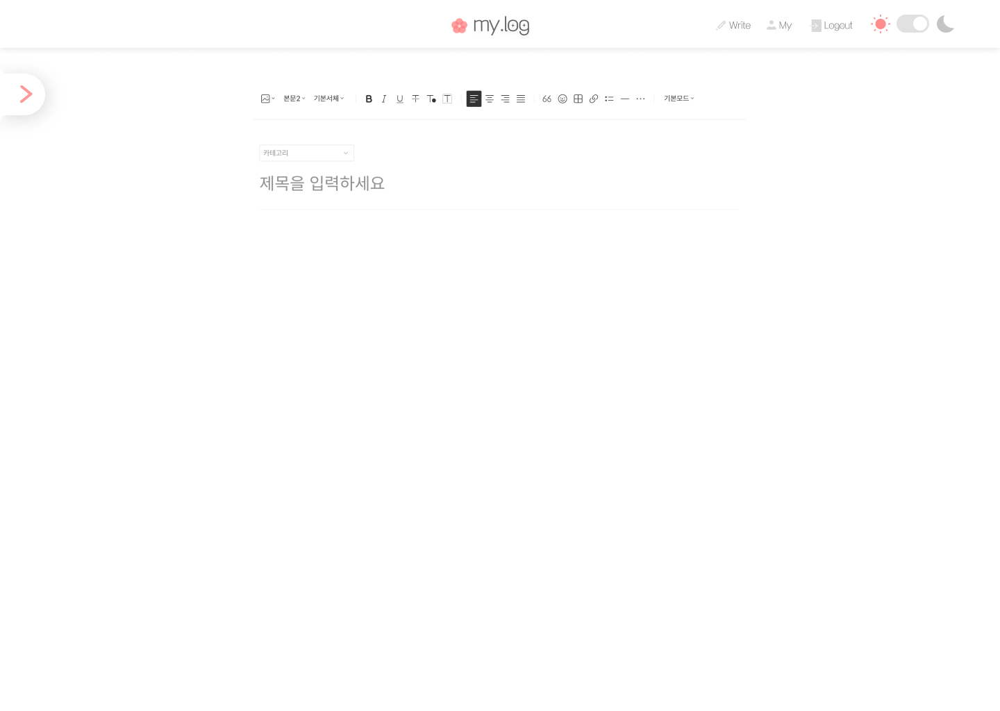

## 화면설계서

### 1. 메인 페이지

-   블로그 메인페이지입니다.
-   최신순 / 인기순으로 토글을 통해 전환이 가능하도록 설계했습니다.

### 2. 사용자 블로그 페이지

-   사용자의 개인 블로그 메인페이지 입니다.
-   왼쪽의 사이드바를 통해 블로그 주인 정보와 카테고리를 볼 수 있습니다.
-   헤더에 있는 `My` 탭을 통해 이동할 수 있습니다.

### 3. 사용자 설정 페이지

-   블로그 사용자의 정보를 수정하는 페이지입니다.
-   블로그 이름, 연락처 정보, 카테고리 정보를 수정할 수 있습니다.

### 4. 게시물 상세 페이지

-   게시물 상세 페이지입니다.

### 5. 게시물 작성 페이지

-   게시물 작성 페이지입니다.

### 6. 로그인 페이지

-   로그인 페이지입니다.
-   아이디, 비밀번호를 입력하면 로그인이 가능합니다.
    
